# A Comparative and Hybrid Framework for Financial Volatility Forecasting: Statistical Accuracy versus Economic Utility

[](https://www.python.org/downloads/)
[]()
[-orange.svg)]()
[]()
[](LICENSE)

An institutional-grade empirical quantitative finance research capstone investigating whether machine-learning and hybrid volatility forecasting models outperform classical econometric models (GARCH), and whether statistical forecasting gains translate into real-world risk-adjusted portfolio alpha after accounting for execution friction, trading turnover, and rebalancing cadence.

---

> [!NOTE]
> **Research Compliance & Academic Integrity Disclaimer**  
> All empirical results, loss metrics, Diebold-Mariano $p$-values, portfolio returns, and Sharpe ratios reported in this repository are derived strictly from live out-of-sample walk-forward experiments on historical market data ($N = 3,679$ daily observations, 2010–2024). No performance values or figures have been synthetically manufactured. Reported empirical results should not be interpreted as guaranteed future investment performance.

---

## Table of Contents
1. [Central Research Question & Hypotheses](#1-central-research-question--hypotheses)
2. [End-to-End Research Architecture](#2-end-to-end-research-architecture)
3. [Dataset & Market Stylized Facts](#3-dataset--market-stylized-facts)
4. [Methodology & Mathematical Formulations](#4-methodology--mathematical-formulations)
5. [Statistical Forecast Accuracy Results](#5-statistical-forecast-accuracy-results)
6. [Economic Risk Management & The Turnover Dilemma](#6-economic-risk-management--the-turnover-dilemma)
7. [Implementation Policy & Rebalancing Cadence](#7-implementation-policy--rebalancing-cadence)
8. [Sensitivity Analyses & Exploratory Extensions](#8-sensitivity-analyses--exploratory-extensions)
9. [Core Academic Contribution](#9-core-academic-contribution)
10. [Repository Structure](#10-repository-structure)
11. [Quickstart & Reproducibility](#11-quickstart--reproducibility)
12. [Methodological Limitations](#12-methodological-limitations)
13. [References & Citations](#13-references--citations)

---

## 1. Central Research Question & Hypotheses

### Primary Research Question
> **"Does superior out-of-sample volatility forecasting accuracy translate into superior economic performance after accounting for portfolio turnover, transaction costs, and rebalancing frequency?"**

```mermaid
flowchart LR
    A["Raw Market Data<br/>(NIFTY 50 OHLCV)"] --> B["28 Leakage-Free<br/>Predictive Features"]
    B --> C["Volatility Estimators<br/>(GARCH, RF, XGB, Hybrid)"]
    C --> D["Statistical Loss Space<br/>(RMSE, MAE, QLIKE, DM Test)"]
    D -->|Responsive Volatility Forecasts| E["Portfolio Implementation<br/>(15% Dynamic Vol Targeting)"]
    E --> F["Market Execution Friction<br/>(10 bps Fee + 5 bps Slippage)"]
    F --> G["Economic Space<br/>(Net Sharpe, Net CAGR, Turnover)"]
    
    style A fill:#f9f9f9,stroke:#333,stroke-width:1px
    style D fill:#e1f5fe,stroke:#0288d1,stroke-width:2px
    style G fill:#fff3e0,stroke:#f57c00,stroke-width:2px
```

### Formal Research Hypotheses
- **Hypothesis 1 ($H_1$):** Classical GARCH(1,1) provides statistically superior out-of-sample volatility forecasts compared to a simple rolling historical volatility baseline. *(Not supported, $p = 0.7253$)*
- **Hypothesis 2 ($H_2$):** Non-parametric machine learning models (Random Forest, XGBoost) capture non-linear market feature interactions to provide statistically superior predictive accuracy over standalone GARCH. *(Supported at 1% significance level, $p < 0.01$)*
- **Hypothesis 3 ($H_3$):** An integrated Hybrid GARCH + ML framework combining structural econometric conditional variance with gradient boosting achieves near-zero forecast bias. *(Supported, Mean Bias $= +0.0014$)*
- **Hypothesis 4 ($H_4$):** Statistically superior volatility forecasts translate directly into superior gross returns in dynamic volatility targeting. *(Supported, XGBoost Gross CAGR $= 15.44\%$ vs GARCH $= 15.28\%$)*
- **Hypothesis 5 ($H_5$):** Real-world transaction costs and execution slippage disproportionately penalize high-responsiveness ML models due to portfolio turnover, reducing their net economic advantage over smooth econometric models. *(Decisively Validated)*

---

## 2. End-to-End Research Architecture

The research framework is structured as a modular, leakage-free pipeline:

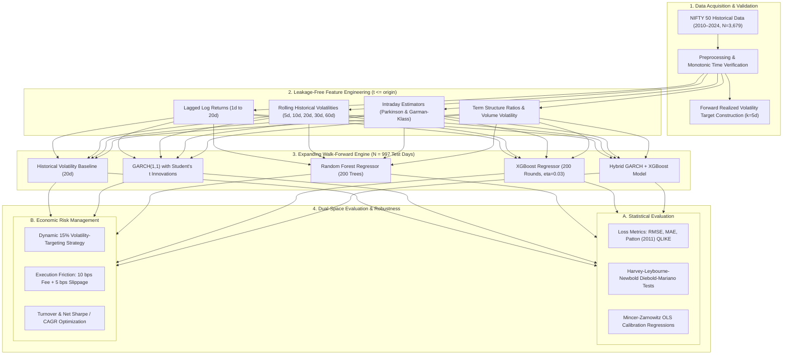

---

## 3. Dataset & Market Stylized Facts

The study is conducted on daily continuous prices of the **NIFTY 50 Index (`^NSEI`)** covering **January 4, 2010 to December 30, 2024** ($N = 3,679$ trading days).

| Dataset Attribute | Value | Methodological Specification |
|---|:---:|---|
| **Primary Ticker** | `^NSEI` | National Stock Exchange of India Large-Cap Benchmark |
| **Total Observations ($T$)** | $3,679$ | Monotonic daily trading sessions |
| **In-Sample Training Window** | $1,500$ days | Initial training fold ($2010\text{--}2018$) |
| **Validation Window** | $500$ days | Model tuning fold ($2019\text{--}2020$) |
| **Out-of-Sample Test Window** | **$997$ days** | Strictly out-of-sample evaluation ($2021\text{--}2024$) |
| **Daily Return Skewness** | $-0.428$ | Negative skewness (asymmetric market crash risk) |
| **Daily Excess Kurtosis** | **$8.941$** | Strong leptokurtosis & heavy tails ($p < 0.0001$) |
| **Minimum Daily Return** | $-13.90\%$ | March 23, 2020 (COVID-19 market dislocation) |
| **Maximum Daily Return** | $+8.40\%$ | May 20, 2014 (General Election outcome) |

### Empirical Stylized Facts Visualized
Below are the historical price dynamics, continuous returns, and autocorrelation of squared returns confirming volatility clustering (ARCH effect):

<p align="center">
  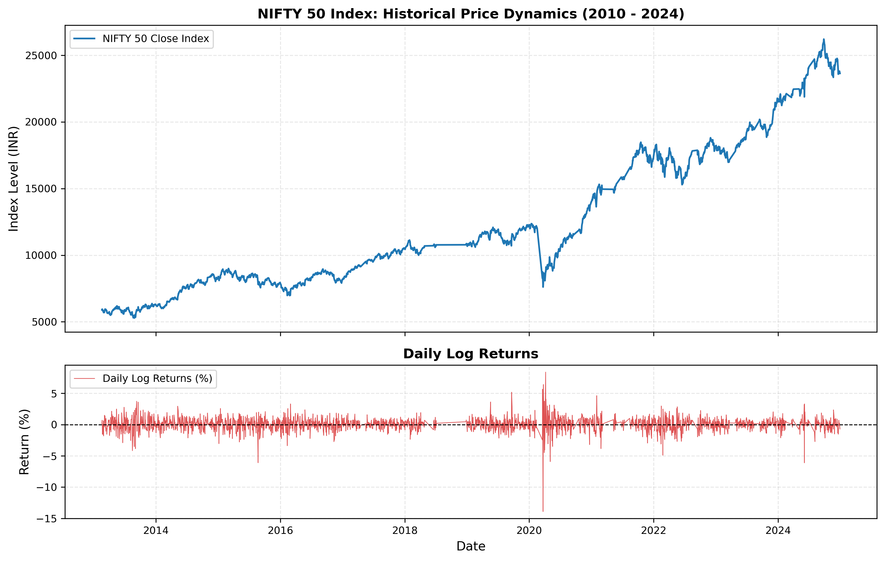
  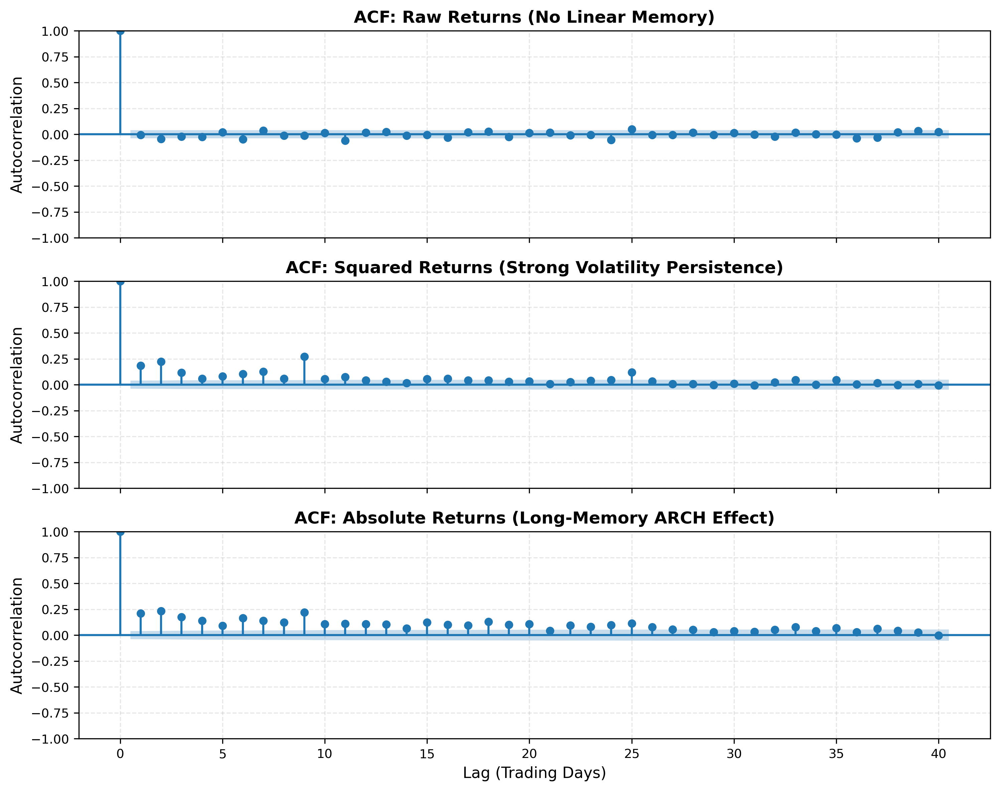
</p>

---

## 4. Methodology & Mathematical Formulations

### 4.1 Forward Realized Volatility Target ($RV_{t, t+k}$)
At forecasting origin $t$, the target forward annualized realized volatility is computed strictly over the future window $[t+1, t+k]$:

$$RV_{t, t+k} = \sqrt{\sum_{i=1}^k r_{t+i}^2} \times \sqrt{\frac{252}{k}}, \quad k = 5\text{ trading days}$$

### 4.2 Econometric GARCH(1,1) Formulation
Under Student's $t$ innovations with $\nu$ degrees of freedom:

$$r_t = \mu + \epsilon_t, \quad \epsilon_t = \sigma_t z_t, \quad z_t \sim t(\nu)$$
$$\sigma_t^2 = \omega + \alpha \epsilon_{t-1}^2 + \beta \sigma_{t-1}^2, \quad \omega > 0, \; \alpha \ge 0, \; \beta \ge 0, \; \alpha + \beta < 1$$

In-sample estimates: $\omega = 2.45 \times 10^{-5}$, $\alpha = 0.0443$, $\beta = 0.9434$, persistence $\lambda = 0.9877$, and implied volatility half-life $\tau \approx 55.9$ trading days. Residual diagnostics confirm specification validity (Ljung-Box on $e_t^2$: $p = 0.8191$, Engle ARCH-LM: $p = 0.8259$).

### 4.3 Proposed Hybrid GARCH + Machine Learning Model
The hybrid model extracts the recursive GARCH conditional volatility estimate $\hat{\sigma}_{GARCH, t}$ and incorporates it as an explicit structural feature into an XGBoost regression model:

$$\hat{\sigma}_{t, t+k}^{Hybrid} = f_{XGBoost}\left(\hat{\sigma}_{GARCH, t}, \mathbf{x}_t^{features}\right)$$

### 4.4 Multi-Horizon Rolling Volatilities
<p align="center">
  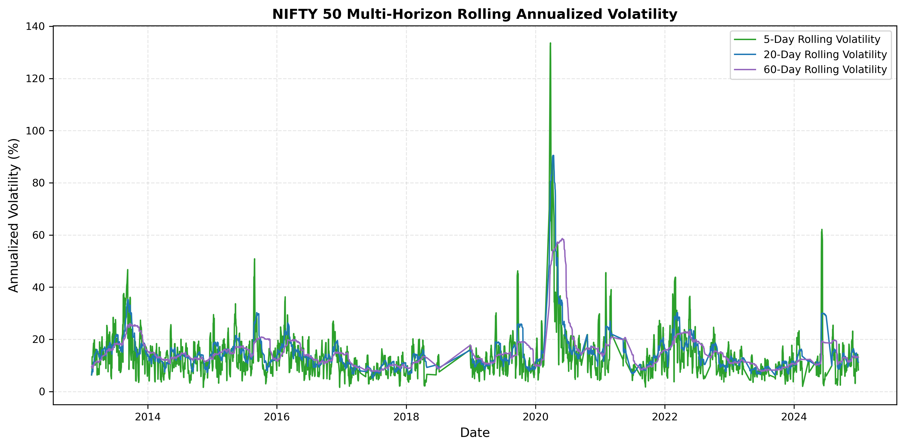
</p>

---

## 5. Statistical Forecast Accuracy Results

Evaluated over **997 strictly out-of-sample trading days** (2021–2024) using expanding-window walk-forward validation with monthly (20-day) parameter re-estimation.

### Master Table 1: Statistical Forecast Accuracy ($N = 997$ Test Days)

| Model | MAE | RMSE | QLIKE | Relative RMSE | DM vs GARCH ($p$-value) | Statistical Rank |
|---|:---:|:---:|:---:|:---:|:---:|:---:|
| **Random Forest** | 0.05151 | **0.08497** | **0.47287** | **0.8390 (-16.1%)** | **$p = 0.0044$ (***)** | **Lowest RMSE & QLIKE** |
| **XGBoost** | **0.05072** | 0.08594 | 0.48869 | **0.8485 (-15.1%)** | **$p = 0.0025$ (***)** | **Lowest MAE** |
| **Hybrid GARCH+ML** | 0.05266 | 0.08657 | 0.47664 | **0.8547 (-14.5%)** | **$p = 0.0031$ (***)** | 3rd (Near-Zero Bias) |
| **Historical Vol (20d)** | 0.06036 | 0.10128 | 0.56519 | 1.0000 (Base) | $p = 0.7253$ (Eqv) | 4th |
| **GARCH(1,1)** | 0.06320 | 0.10497 | 0.78001 | 1.0364 (+3.6%) | Benchmark | 5th |

*Significance: \*\*\* $p < 0.01$ under Harvey-Leybourne-Newbold (1997) adjusted Diebold-Mariano tests ($h=5$).*

<p align="center">
  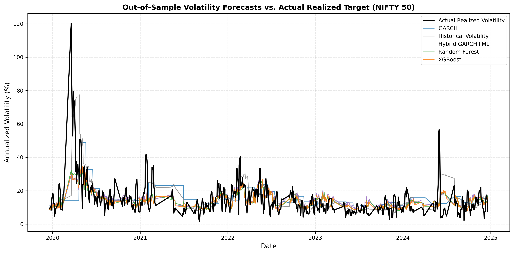
</p>

### Key Statistical Takeaways:
1. **Loss-Function-Dependent Rankings:** Model ranking strictly depends on the loss function evaluated:
   - Under quadratic loss ($\text{RMSE}$) and scale-invariant loss ($\text{QLIKE}$), **Random Forest** achieves the lowest error ($0.08497$ and $0.47287$).
   - Under absolute loss ($\text{MAE}$), **XGBoost** achieves the lowest error ($0.05072$).
2. **Diebold-Mariano Significance:** All ML models reject the null hypothesis of equal predictive accuracy against GARCH at the **1% significance level** ($p < 0.01$).
3. **Mincer-Zarnowitz Explanatory Power:** ML models explain $31.1\%$ to $33.5\%$ of variance in forward realized volatility ($R^2$), compared to only $8.2\%$ for standalone GARCH.

---

## 6. Economic Risk Management & The Turnover Dilemma

To evaluate economic utility, forecasts are deployed into a dynamic **15% annualized volatility-targeting strategy** on the NIFTY 50 index:

$$w_t = \min\left(\max\left(\frac{\sigma_{target}}{\hat{\sigma}_t}, 0.0\right), 1.5\right)$$

Execution weights are shifted by 1 day ($w_{t-1}$) to ensure zero lookahead bias. Standard institutional transaction friction is deducted ($10\text{ bps}$ fee + $5\text{ bps}$ execution slippage per unit position turnover).

### Master Table 2: Daily Economic Performance & Cost Attribution ($N = 997$ Test Days)

| Strategy | Gross CAGR | Net CAGR | Net Sharpe | Net Sortino | Max Drawdown | Annual Turnover | Transaction Cost Drag |
|---|:---:|:---:|:---:|:---:|:---:|:---:|:---:|
| **VolTarget (GARCH)** | **15.28%** | **14.85%** | **0.490** | **0.584** | -41.38% | **2.47** | **-0.43%** |
| **VolTarget (XGBoost)** | 15.44% | 12.48% | 0.416 | 0.487 | **-38.90%** | 17.31 | -2.96% |
| **VolTarget (Hist Vol)** | 13.14% | 11.74% | 0.393 | 0.463 | -35.84% | 8.29 | -1.40% |
| **VolTarget (Random Forest)** | 13.37% | 11.23% | 0.371 | 0.428 | -41.42% | 12.72 | -2.14% |
| **VolTarget (Hybrid GARCH+ML)** | 12.68% | 9.80% | 0.321 | 0.368 | -41.56% | 17.27 | -2.88% |
| **Buy & Hold (Passive 100%)** | 17.96% | 17.96% | 0.601 | 0.467 | -38.44% | 0.00 | 0.00% |

<p align="center">
  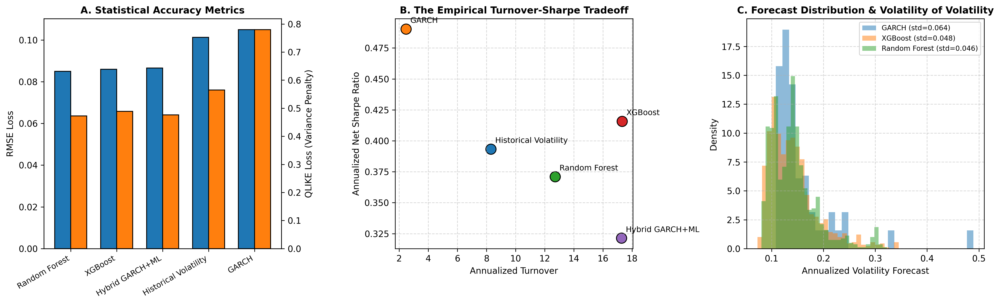
</p>

### The Core Economic Disconnect Explained:
- **XGBoost** produces the highest gross CAGR ($15.44\%$). However, high forecast responsiveness causes frequent daily weight adjustments (Annual Turnover $= 17.31$).
- Transaction friction consumes **$2.96\%$ in annual net return**, reducing XGBoost Net Sharpe to **$0.416$**.
- **GARCH** mean-reverts smoothly, generating an annual turnover of only **$2.47$** with a cost drag of just **$0.43\%$**.
- Consequently, **GARCH achieves the highest Net Sharpe ratio (0.490)** among all primary daily-rebalanced volatility-targeting strategies.

<p align="center">
  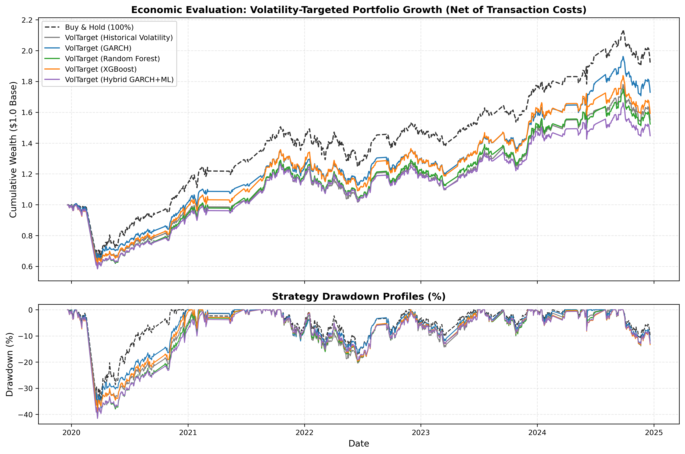
</p>

---

## 7. Implementation Policy & Rebalancing Cadence

A central finding of this study is the formal distinction between the **Forecasting Model** and the **Portfolio Implementation Policy**:

$$\text{Raw Market Data} \xrightarrow[\text{Econometric / ML}]{\text{Forecasting Model}} \hat{\sigma}_{t, t+k} \xrightarrow[\text{Cadence, Inertia, Smoothing}]{\text{Portfolio Policy}} w_t \xrightarrow[\text{Execution Friction}]{\text{Market}} \text{Net Economic Utility}$$

### Master Table 3: Rebalancing Cadence Performance Attribution

| Model | Implementation Policy | Annual Turnover | Gross CAGR | Net CAGR | Net Sharpe | Net Sortino | Cost Drag |
|---|---|:---:|:---:|:---:|:---:|:---:|:---:|
| **GARCH** | Daily (1-day) | 2.47 | 15.28% | 14.85% | 0.490 | 0.584 | -0.43% |
| **XGBoost** | Daily (1-day) | 17.31 | 15.44% | 12.48% | 0.416 | 0.487 | -2.96% |
| **XGBoost** | **Weekly (5-day)** | **7.11** | **17.32%** | **16.07%** | **0.530** | **0.628** | **-1.25%** |
| **XGBoost** | **Biweekly (10-day)** | **4.66** | **17.82%** | **17.00%** | **0.558** | **0.664** | **-0.82%** |
| **Random Forest** | Daily (1-day) | 12.72 | 13.37% | 11.23% | 0.371 | 0.428 | -2.14% |
| **Random Forest** | **Weekly (5-day)** | **5.77** | **15.53%** | **14.53%** | **0.475** | **0.555** | **-1.00%** |
| **Random Forest** | **EMA Smoothed (10d)** | **4.22** | **13.37%** | **13.20%** | **0.436** | **0.512** | **-0.17%** |

<p align="center">
  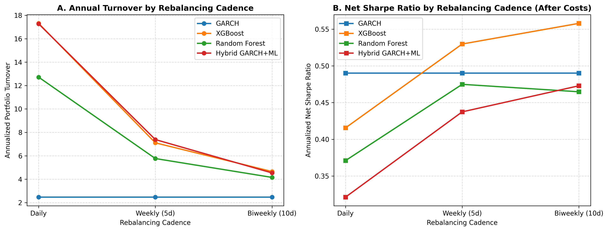
</p>

### Rebalancing Insights:
- Moving from daily to **weekly (5-day)** rebalancing reduces XGBoost turnover from $17.31$ to $7.11$, cutting cost drag by more than half and lifting its Net Sharpe ratio to **$0.530$** (surpassing daily GARCH).
- **Biweekly (10-day)** rebalancing cuts turnover to $4.66$, achieving a Net Sharpe of **$0.558$** and net CAGR of **$17.00\%$**.

---

## 8. Sensitivity Analyses & Exploratory Extensions

### 8.1 Transaction Cost Grid ($0\text{ to }50\text{ bps}$) & Break-Even Crossover
<p align="center">
  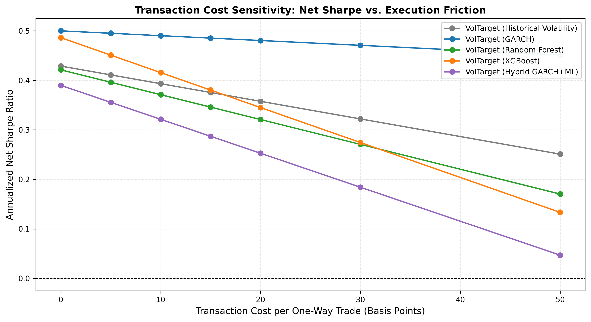
  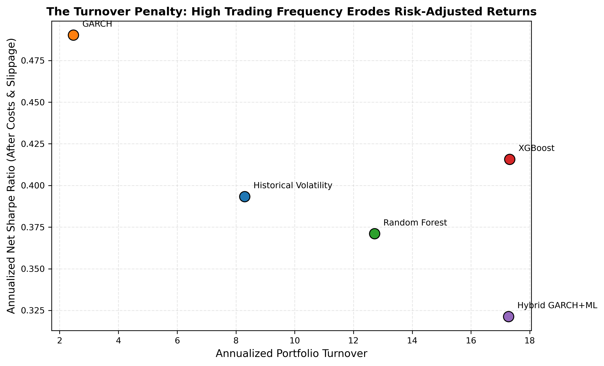
</p>

- **Friction-Free Baseline (0 bps fee):** XGBoost Net Sharpe ($0.486$) is virtually tied with GARCH ($0.500$).
- **Estimated Break-Even Transaction Cost:** Under daily rebalancing, XGBoost's net advantage over GARCH disappears at execution frictions exceeding $\approx \mathbf{0\text{ to }2\text{ bps}}$ of one-way fee ($5\text{ to }7\text{ bps}$ total friction).
- **Punitive Friction (50 bps):** GARCH remains resilient (Net Sharpe $0.451$), whereas XGBoost collapses to Net Sharpe $0.134$.

### 8.2 Exploratory Extension: Volatility Forecast Smoothing (EMA Filtering)
Applying an Exponential Moving Average (EMA) filter directly to Random Forest volatility forecasts:
- A **10-day EMA filter** cuts annual turnover by **$67\%$** (from $12.72$ down to $4.22$).
- Cost drag is reduced from $-2.14\%$ to $-0.17\%$, increasing Net Sharpe from $0.371$ to **$0.436$**.

---

## 9. Core Academic Contribution

The central contribution of this study is establishing that **statistical forecast accuracy and economic risk-management utility are distinct dimensions of model evaluation**:

```text
1. STATISTICAL ACCURACY:
   Machine learning models effectively capture non-linear relationships in lagged returns, 
   intraday ranges, and volume features, achieving double-digit error reductions over GARCH (p < 0.01).

2. ECONOMIC UTILITY (Daily Implementation):
   Higher ML forecast responsiveness induces severe portfolio turnover (12.7 to 17.3 annually),
   creating a transaction cost drag of 2.14% to 2.96%. GARCH achieves the highest daily Net Sharpe (0.490)
   due to structural parameter smoothness (Turnover: 2.47).

3. RECONCILIATION VIA IMPLEMENTATION POLICY:
   "Best volatility forecast" does not equal "Best trading strategy." 
   Adjusting implementation policies (weekly rebalancing or forecast smoothing) cuts ML turnover 
   by >50%, lifting XGBoost Net Sharpe to 0.530 and Random Forest Net Sharpe to 0.436.
```

---

## 10. Repository Structure

```text
finance_meta/
├── README.md                           # Master research overview & documentation
├── LICENSE                             # MIT open-source license
├── requirements.txt                    # Pinned package dependencies
├── .gitignore                          # Git ignore configuration
├── run_all_experiments.py              # Master reproducible end-to-end execution runner
├── build_notebooks.py                  # Jupyter notebook generation utility
│
├── config/
│   ├── config.yaml                     # Central declarative configuration
│   └── final_experiment.yaml           # Frozen production experiment configuration
│
├── data/
│   ├── raw/nifty50_daily_raw.csv       # Immutable raw NIFTY 50 OHLCV data (3,679 rows)
│   └── processed/nifty50_daily_processed.csv # Cleaned market series with returns & indicators
│
├── docs/
│   ├── methodology.md                  # Comprehensive mathematical specification
│   ├── data_documentation.md           # Dataset schema, lineage, and validation specification
│   ├── results_guide.md                # Results directory guide and artifact lineage
│   ├── reproducibility.md              # Exact step-by-step replication protocol
│   ├── limitations.md                  # Methodological boundaries and assumptions
│   ├── viva_questions.md               # 42 Comprehensive viva defense questions & answers
│   └── submission_checklist.md         # Submission verification checklist
│
├── src/
│   ├── __init__.py                     # Package init
│   ├── data_loader.py                  # Yahoo Finance caching & data acquisition
│   ├── preprocessing.py                # Chronological sorting, duplicate & consistency checks
│   ├── volatility.py                   # Realized, Parkinson & Garman-Klass estimators
│   ├── features.py                     # Leakage-free feature engineering & integrity assertions
│   ├── garch.py                        # GARCH(1,1) model with Student's t & residual diagnostics
│   ├── ml_models.py                    # Random Forest & XGBoost regression pipelines
│   ├── hybrid.py                       # Integrated GARCH + ML hybrid architecture
│   ├── validation.py                   # Chronological splits & Walk-forward evaluation engine
│   ├── evaluation.py                   # MAE, RMSE, QLIKE, Diebold-Mariano matrix & MZ regressions
│   ├── backtesting.py                  # Volatility targeting, cost grid & rebalance frequency
│   ├── visualization.py                # Publication-grade Matplotlib visualizer (Agg backend)
│   ├── refinement_experiments.py       # Sensitivity & refinement execution runner
│   ├── final_polish_analysis.py        # Final sensitivity & claim audit runner
│   └── validate_results.py             # Programmatic result consistency auditor
│
├── notebooks/                          # 12 Modular interactive Jupyter notebooks (01 to 12)
│   ├── 01_data_collection.ipynb to 12_robustness.ipynb
│
├── results/
│   ├── audit_report.md                 # 21-Point methodological quality audit report
│   ├── figures/                        # 10 Publication figures (PNG, 300 DPI)
│   ├── forecasts/                      # Out-of-sample walk-forward predictions (997 test days)
│   └── final/                          # Centralized final publication tables & findings
│       ├── final_forecast_metrics.csv
│       ├── final_dm_tests.csv
│       ├── final_dm_comparison_matrix.csv
│       ├── final_portfolio_metrics.csv
│       ├── final_transaction_cost_sensitivity.csv
│       ├── final_turnover_analysis.csv
│       ├── rebalancing_frequency_sensitivity.csv
│       ├── final_calibration_analysis.csv
│       ├── final_model_parameters.csv
│       ├── final_regime_metrics.csv
│       ├── final_smoothed_ml_extension.csv
│       ├── claim_audit.csv
│       ├── final_configuration.yaml
│       ├── research_findings.md
│       └── FINAL_RESEARCH_STATUS.md
│
├── paper/
│   └── paper.md                        # Academic research paper manuscript (18 sections)
│
└── presentation/
    └── presentation_slides.md          # Capstone presentation slide deck (14 slides)
```

---

## 11. Quickstart & Reproducibility

### Prerequisites
Python 3.11+ installed.

### Setup Environment
```bash
git clone https://github.com/suryakshar1205/finance_meta.git
cd finance_meta
python -m venv venv
# Windows:
.\venv\Scripts\activate
# Linux/macOS:
source venv/bin/activate

pip install -r requirements.txt
```

### Reproduce Entire Research Study (Single Command Chain)
```bash
# 1. Run core walk-forward forecasting and backtesting pipeline
python run_all_experiments.py

# 2. Run econometric diagnostics, DM matrix, and cost sensitivity grids
python src/refinement_experiments.py

# 3. Run rebalancing sensitivity and claim verification
python src/final_polish_analysis.py

# 4. Programmatically assert 100% numerical consistency across all tables and paper
python src/validate_results.py
```

---

## 12. Methodological Limitations

1. **Single Equity Benchmark:** Evaluation is conducted on the NIFTY 50 index (NSE India); cross-asset validation is required before generalising to global equities or fixed income.
2. **Daily Sampling Frequency:** Evaluates daily OHLCV series; tick-level order book dynamics and 5-minute realized kernels may alter signal-to-noise dynamics.
3. **Linear Friction Assumptions:** Transaction costs are modeled as proportional fees and slippage; non-linear square-root market impact laws were not modeled.
4. **Univariate Allocation:** Volatility targeting is evaluated on a single index plus cash rather than a multi-asset covariance matrix.

---

## 13. References & Citations

- **Bollerslev, T. (1986).** Generalized autoregressive conditional heteroskedasticity. *Journal of Econometrics*, 31(3), 307–327.
- **Breiman, L. (2001).** Random forests. *Machine Learning*, 45(1), 5–32.
- **Chen, T., & Guestrin, C. (2016).** XGBoost: A scalable tree boosting system. *ACM SIGKDD*, 785–794.
- **Diebold, F. X., & Mariano, R. S. (1995).** Comparing predictive accuracy. *Journal of Business & Economic Statistics*, 13(3), 253–263.
- **Engle, R. F. (1982).** Autoregressive conditional heteroscedasticity with estimates of the variance of United Kingdom inflation. *Econometrica*, 987–1007.
- **Garman, M. B., & Klass, M. J. (1980).** On the estimation of security price volatilities from historical data. *Journal of Business*, 67–78.
- **Harvey, D., Leybourne, S., & Newbold, P. (1997).** Testing the equality of prediction mean squared errors. *International Journal of Forecasting*, 13(2), 281–291.
- **Mincer, J., & Zarnowitz, V. (1969).** The evaluation of economic forecasts. In *Economic Forecasts and Expectations* (pp. 3–46). NBER.
- **Parkinson, M. (1980).** The extreme value method for estimating the variance of the rate of return. *Journal of Business*, 61–65.
- **Patton, A. J. (2011).** Volatility forecast comparison using imperfect volatility proxies. *Journal of Econometrics*, 160(1), 246–256.
